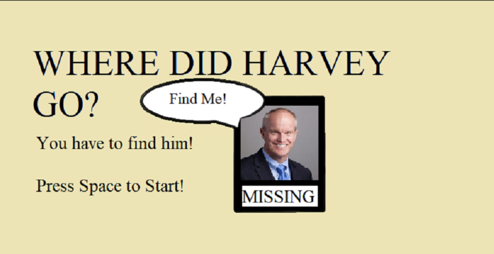
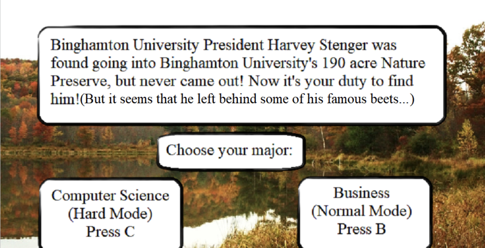
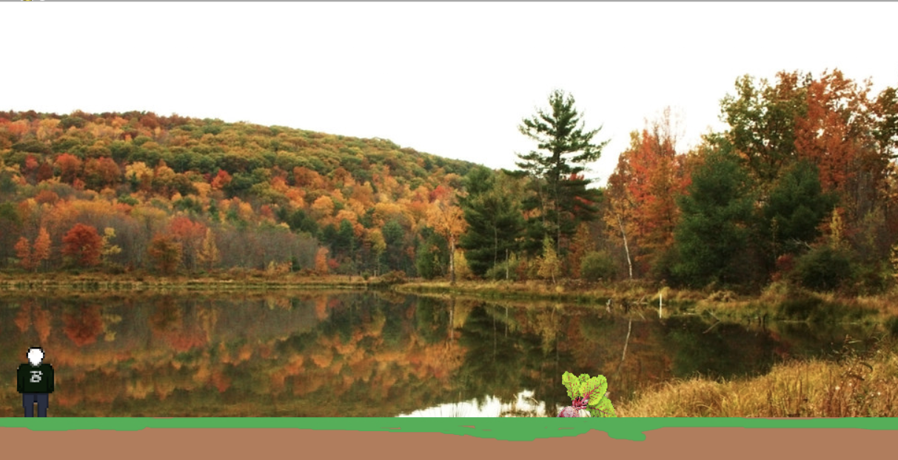
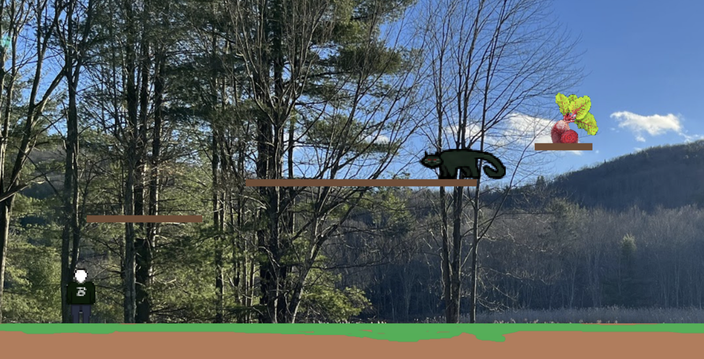
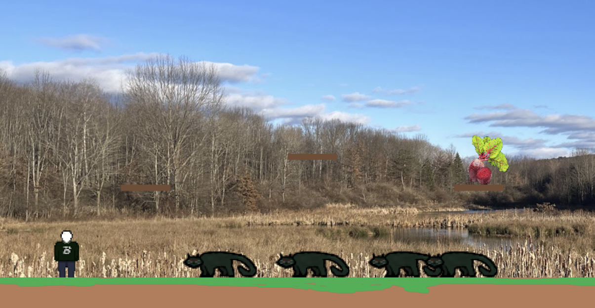
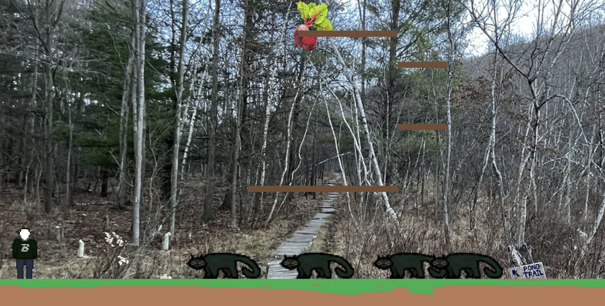
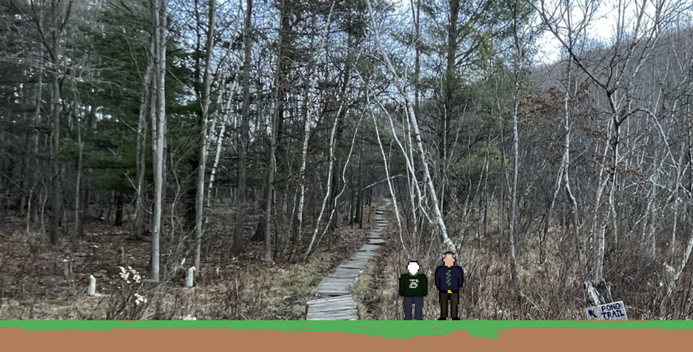
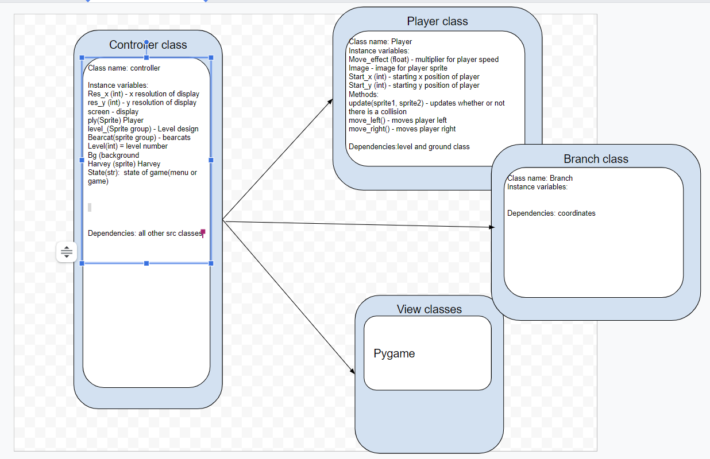

:warning: Everything between << >> needs to be replaced (remove << >> after replacing)
# CS110 Project Proposal
# << Project Title >>
## CS 110 Final Project
### Fall, 2022
### [Assignment Description](https://docs.google.com/document/d/1H4R6yLL7som1lglyXWZ04RvTp_RvRFCCBn6sqv-82ps/edit?usp=sharing)

 [[repl](#)](https://replit.com/join/fizwwfyakr-frankrumreich) 

### [[link to demo presentation slides](https://docs.google.com/presentation/d/1l5OdsMlftltgthLHm9CmS-mNswvh1ZmHHgjIrq2fiAk/edit?usp=sharing)]

### Team: Allen and Frankie
#### Frank Rumreich, Allen Domingo 

***

## Project Description

Our project is a platformer game in which the player has to navigate through levels in order to find Harvey Stenger, who has gone missing in the nature preserve. There are bearcat enemies which when touched bring you back to the start of the level, and the goal of each level is to reach the beet. At the start, you can choose to either be a computer science major or a business major, depending on the difficulty you want. Choosing computer science as your major makes you slower.

***    

## User Interface Design

- **Initial Concept**
  - << A wireframe or drawing of the user interface concept along with a short description of the interface. You should have one for each screen in your program. For example, if your program has a start screen, game screen, and game over screen, you should include a wireframe / screenshot / drawing of each one and a short description of the components. >>
    
    
- **Final GUI**
        * 
        * 
        * 
        * 
        * 
        * 
        *  

***        

## Program Design

* Non-Standard libraries
    * << You should have a list of any additional libraries or modules used (pygame, request) beyond non-standard python. 
         For each additional module you should include
         - url for the module documentation
         - a short description of the module >>

  Pickle :
  -https://docs.python.org/3/library/pickle.html
  - Allows the program to store, read, and edit data locally
* Class Interface Design
    * << A simple drawing that shows the class relationships in your code (see below for an example). This does not need to be overly detailed, but should show how your code fits into the Model/View/Controller paradigm. >>
        *  
* Classes
    class Player:
     __init__:
        health_effect,_move_effect,speed,health,image,rect
     move_left:
        rect.x
     jump:
        jump_time,jump_speed,rect.y
     attack:
         image load
     hit:
          image,load,health
    class Bearcat:
     __init__:
        health_effect,_move_effect,speed,health,image,rect
     move_left:
        rect.x
     move_right:
        rect.x
     jump:
        jump_time,jump_speed,rect.y
     attack:
         image load
     hit:
          image,load,health
  
    class Harvey:
     __init__:
        image and rect load
    
    * << You should have a list of each of your classes with a description. >>

## Project Structure and File List

The Project is broken down into the following file structure:

* main.py
* src
    * << all of your python files should go here >>
* assets
    * << all of your media, i.e. images, font files, etc, should go here) >>
* etc
    * << This is a catch all folder for things that are not part of your project, but you want to keep with your project >>

***

## Tasks and Responsibilities 

   
   Allen - Most of controller class, player class, level builder class, harvey class, next class, menus
   Frankie - Level builder class, some controller class, some bearcat class, sprites, river prior to removal, ATP
   collaborated on readme/proposal

## Testing

* Writing code little by little, and testing if it functions properly, and printing characteristics like the level, but mainly testing graphically occurred.

## ATP

| Step                 |Procedure             |Expected Results                   |Pass               |
|----------------------|:--------------------:|----------------------------------:|------------------:|
|  1                   | Run Program          |GUI screen displays with the starting menu|                |
|  2                   | press space to begin game | major selection menu appears |               |
|  3                   | press B on major selection | game begins                 |               |
|  4                   | hold down 'D'  key   | player moves right                |               |
|  5                   | hold down 'A' key    | player moves left                 |               |
|  6                   | press 'W' key        | player jumps upwards then falls back down |               |
|  7                   |move player to land on platform  | player stops falling, stays on platform |               |
|  8                   | jump onto platform from underneath | player jumps through platform, lands on platform on the way down |               |
|  9                   | collide with a bearcat| player is moved back to the starting point, at the same level |               |
|  10                  | collide with a beet  | the level changes, which includes background and level layout|               |
|  11                  | press space over harvey | ending dialogue box pops up |               |

